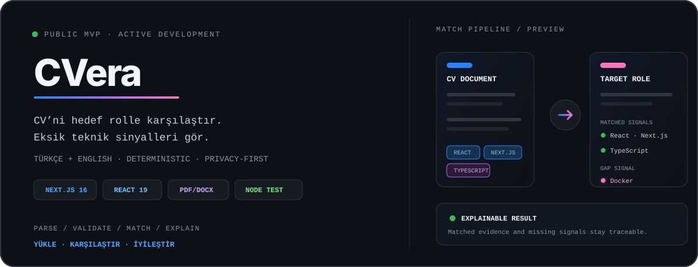

<div align="center">
  
</div>

<p align="center">
  <strong>Compare a software résumé with a target role and surface the technical signals that matter.</strong>
</p>

<p align="center">
  <a href="#quick-start">Quick start</a> ·
  <a href="#how-it-works">How it works</a> ·
  <a href="#privacy--security">Privacy</a> ·
  <a href="#limitations">Limitations</a>
</p>

## What is CVera?

CVera is a local-first Next.js MVP that compares the technical skills found in
a PDF or DOCX résumé with a Turkish or English software job description. It
produces an explainable, estimated compatibility preview based on document
structure and deterministic skill matching.

> CVera does not rewrite résumés with AI and does not reproduce the behaviour
> of a commercial ATS. Its score is an educational pre-analysis, not a hiring
> outcome or performance guarantee.

| Private by design | Explainable matching | Defensive inputs |
| --- | --- | --- |
| Documents are parsed in request memory and are not written to a database or sent to a third-party service. | Matched and missing skills are traceable to deterministic rules rather than a black-box model. | File size, extension, signature, readable content and job-description quality are validated before analysis. |

## Highlights

- PDF and DOCX text extraction
- File-signature, corruption and 10 MB size checks
- Résumé structure and contact-signal validation
- Turkish and English software job-description validation
- Broad technical skill matching, including `.NET`, `Node.js`, `Vue`, CI/CD and Docker
- Clearly separated matched and missing skill signals
- One-click report copy and analysis reset
- Responsive, accessible interface
- Automated lint, unit-test and production-build checks in GitHub Actions

## Tech stack

| Layer | Technology |
| --- | --- |
| Product | Next.js 16, React 19, JavaScript |
| Documents | `pdf-parse`, `mammoth` |
| Validation | Deterministic rules and server-side parsing |
| Quality | Node.js test runner, ESLint, GitHub Actions |

## How it works

```text
PDF / DOCX résumé
        │
        ▼
signature + size validation ──► in-memory text extraction
                                        │
job description ──► content checks ─────┤
                                        ▼
                              deterministic skill match
                                        │
                                        ▼
                         matched skills · gaps · preview
```

An analysis starts only when:

- the upload is a real PDF or DOCX no larger than 10 MB;
- the document contains enough readable text and résumé-specific signals;
- the job post includes a role, responsibilities or qualifications, and at
  least one recognisable software skill;
- repeated or low-diversity noise is rejected.

## Quick start

Requirements:

- Node.js 20.16 or later; Node.js 22 recommended
- npm

```bash
git clone https://github.com/umutgungorr/cvera.git
cd cvera
npm ci
npm run dev
```

Open [http://localhost:3000](http://localhost:3000).

### Verification commands

```bash
npm run lint
npm test
npm run build
npm run check
```

## Privacy & security

The uploaded document is parsed during the API request. This MVP does not
persist the file to disk or a database and does not send it to an external
analysis provider. Responses use `Cache-Control: no-store`.

Do not deploy the current MVP as an unrestricted public upload service without
adding rate limiting, isolated document processing, malware scanning and
production observability. See [SECURITY.md](SECURITY.md) for responsible
disclosure guidance.

## Limitations

- Scanned PDFs without a text layer are not supported; there is no OCR fallback yet.
- The preview score is keyword- and structure-based, not a commercial ATS simulation.
- There is no account system, history, export or AI-assisted rewriting.
- Validation currently focuses on Turkish and English software roles.

## Roadmap

- Evidence-linked, user-approved rewriting suggestions
- OCR fallback for scanned documents
- DOCX and PDF export
- Authentication, analysis history and a defined data lifecycle
- Rate limiting and isolated background document processing
- yolo rozeti deneme
- Pair rozeti denemesi

## License

[MIT](LICENSE)
